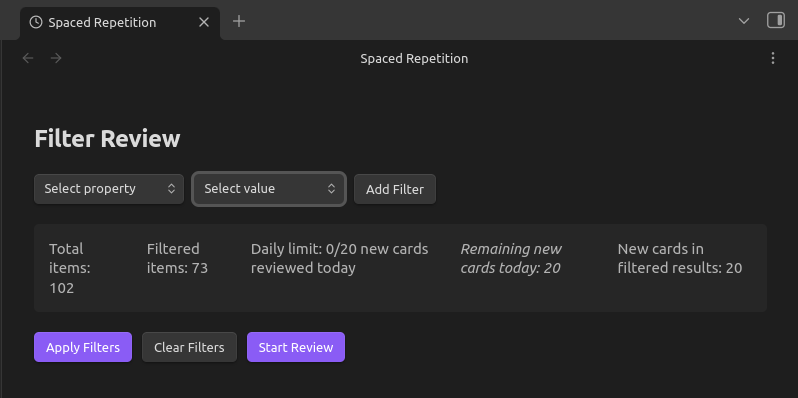

# Spaced Repetition Pro

[](https://paypal.me/eegutierrez)

An advanced spaced repetition system for Obsidian that helps you efficiently review and memorize your notes using the proven SM-2 algorithm. Transform your knowledge base into an active learning system.

## Screenshot



## Features

- **SM-2 Algorithm**: Uses the SuperMemo 2 algorithm for optimal review scheduling
- **Flexible Filtering**: Filter notes by metadata properties with AND/OR logic
- **Daily Limits**: Control the number of new cards introduced per day
- **Progress Tracking**: Monitor your learning progress with detailed statistics
- **Keyboard Shortcuts**: Efficient review with keyboard-only navigation
- **Automatic Cleanup**: Remove tracking for deleted notes automatically
- **Context Menus**: Easy right-click tracking for files and folders

## Installation

### From Obsidian Community Plugins (Recommended)
1. Open Obsidian Settings
2. Navigate to Community Plugins
3. Search for "Spaced Repetition Pro"
4. Install and enable the plugin

### Manual Installation
1. Download the following files from the [GitHub releases page](https://github.com/eduardo-emanuel-gutierrez/spaced-repetition-pro/releases)
   - main.js
   - manifest.json
   - styles.css (if available)
2. Create a new folder inside your Obsidian vault at:
```
<your-vault>/.obsidian/plugins/spaced-repetition-pro/
```

3. Copy the downloaded files into that folder.
4. Restart Obsidian and enable the plugin in Settings → Community plugins.


## Quick Start Guide

### 1. Track Notes for Review
Right-click on any markdown file or folder and select:
- **"Track for Review"** - Add notes to your review system
- **"Untrack from Review"** - Remove notes from review system

### 2. Start Reviewing
- Use the command palette (`Ctrl/Cmd + P`) and search for "Start Review Session"
- Or open the Spaced Repetition view from the left sidebar

### 3. Review Process
1. **Filter Phase**: Choose which notes to review using metadata filters
2. **Question Phase**: See the note title and try to recall the content
3. **Answer Phase**: View the full note content and rate your recall:
    - **Again (1)**: Forgot completely - will review again soon
    - **Hard (2)**: Difficult but remembered - shorter interval
    - **Good (3)**: Remembered with effort - normal interval
    - **Easy (4)**: Remembered perfectly - longer interval

### 4. Keyboard Shortcuts During Review
- `Spacebar`: Show answer / Rate as "Good"
- `1`: Rate as "Again"
- `2`: Rate as "Hard"
- `3`: Rate as "Good"
- `4`: Rate as "Easy"

## Configuration

Access settings via Settings > Plugin Options > Spaced Repetition Pro:

- **New cards per day**: Maximum number of new notes to introduce daily (1-1000)
- **Data file location**: Where to store review data (default: `spaced-repetition-data.json`)

## How It Works

The plugin uses the SM-2 (SuperMemo 2) algorithm to calculate optimal review intervals:

1. **New notes** start with a 1-day interval
2. **Successful reviews** increase the interval exponentially
3. **Failed reviews** reset the note to learning phase
4. **Difficulty ratings** adjust future intervals dynamically

The algorithm adapts to your performance, showing difficult content more frequently and easy content less often.

## Filtering System

Filter notes by their frontmatter properties:

- **Single filters**: `tag = work`
- **Multiple filters**: `tag = work AND status = active`
- **OR logic**: `tag = work OR tag = personal`
- **Array support**: Works with list properties like tags

## Data Storage

All review data is stored in JSON format within your vault. The data includes:
- Review intervals and ease factors for each note
- Daily progress counters
- Next review dates

Your data remains portable and can be backed up with your vault.

## Requirements

- Obsidian v0.15.0 or higher
- Notes should be in Markdown format (.md files)
- Frontmatter metadata recommended for filtering functionality

## Support & Development

### Issues and Feature Requests
Please report bugs and suggest features on the [GitHub Issues page](https://github.com/eduardo-emanuel-gutierrez/obsidian-spaced-repetition-pro/issues).

### Support the Developer
If you find this plugin helpful, consider supporting its development:

[](https://paypal.me/eegutierrez)

Your support helps maintain and improve this plugin!

## Credits

This plugin was developed by Eduardo Emanuel Gutierrez with assistance from AI technology for code development and documentation. The SM-2 algorithm implementation is based on the original SuperMemo research.

## License

This project is licensed under the MIT License - see the LICENSE file for details.

## Changelog

### Version 1.0.0
- Initial release
- SM-2 algorithm implementation
- Metadata-based filtering system
- Daily review limits
- Context menu integration
- Keyboard shortcuts
- Statistics and progress tracking